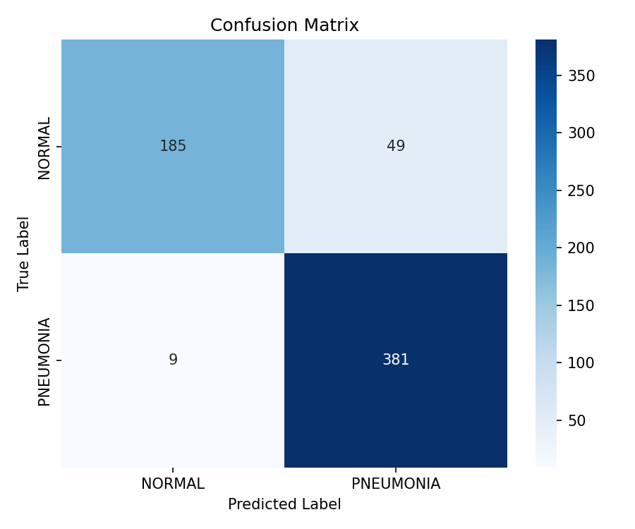
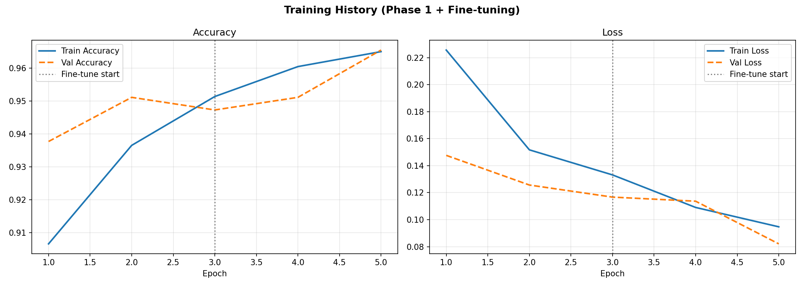

# Pneumonia Detection Using Chest X-Ray Images

A deep learning project for classifying chest X-ray images as **NORMAL** or **PNEUMONIA** using transfer learning with the **VGG16** convolutional neural network.

## Project Overview

This project uses a pretrained VGG16 model to perform binary classification of chest X-ray images. The model is trained using transfer learning and subsequently fine-tuned to improve classification performance.

The pipeline includes:

- Image preprocessing and normalization
- Data augmentation
- Transfer learning using VGG16
- Custom classification layers
- Dropout regularization
- Two-phase training and fine-tuning
- Early stopping and model checkpointing
- Independent test-set evaluation
- Confusion matrix generation
- Precision, recall and F1-score evaluation
- Prediction of individual X-ray images with confidence scores

## Dataset

The project uses the **Chest X-Ray Images (Pneumonia)** dataset containing chest X-ray images divided into two classes:

- NORMAL
- PNEUMONIA

The dataset is organized into training and testing directories.

The training data is further divided into:

- 80% Training
- 20% Validation

Dataset used:  
**Chest X-Ray Images (Pneumonia) – Kaggle**

> The dataset is not included in this repository due to its size.

## Tech Stack

- Python
- TensorFlow
- Keras
- VGG16
- NumPy
- Scikit-learn
- Matplotlib
- Seaborn

## Model Architecture

The project uses **VGG16 pretrained on ImageNet** with the original classification head removed.

The custom classification head consists of:

- Flatten layer
- Dense layer with 256 neurons and ReLU activation
- Dropout (0.5)
- Output layer with Softmax activation

Training is performed in two phases.

### Phase 1 — Transfer Learning

The pretrained VGG16 convolutional layers are frozen while the custom classification layers are trained.

### Phase 2 — Fine-Tuning

The final convolutional block of VGG16 is unfrozen and trained using a lower learning rate to fine-tune the pretrained features for chest X-ray classification.

## Model Performance

The model was evaluated on an independent test set containing **624 chest X-ray images**.

| Metric | Result |
|---|---:|
| Test Accuracy | 90.71% |
| Pneumonia Precision | 89% |
| Pneumonia Recall | 98% |
| Pneumonia F1-Score | 93% |
| Normal Precision | 95% |
| Normal Recall | 79% |
| Normal F1-Score | 86% |

### Confusion Matrix

The model produced the following results:

- 185 NORMAL images correctly classified
- 381 PNEUMONIA images correctly classified
- 49 NORMAL images classified as PNEUMONIA
- 9 PNEUMONIA images classified as NORMAL



## Training Performance

Training and validation accuracy/loss were monitored during both the initial transfer-learning phase and fine-tuning phase.



## Project Structure

```text
PneumoniaClassification/
│
├── pneumonia_detection.py
├── README.md
├── requirements.txt
├── .gitignore
├── confusion_matrix.png
└── training_curves.png
```

## Installation

Clone the repository:

```bash
git clone https://github.com/Anandbala10/pneumonia-classification
cd pneumonia-classification
```

Install the required dependencies:

```bash
pip install -r requirements.txt
```

## Dataset Setup

Download the Chest X-Ray Images (Pneumonia) dataset and organize it as:

```text
chest_xray/
├── train/
│   ├── NORMAL/
│   └── PNEUMONIA/
└── test/
    ├── NORMAL/
    └── PNEUMONIA/
```

The Python script expects:

```python
TRAIN_DIR = "chest_xray/train"
TEST_DIR = "chest_xray/test"
```

## Running the Project

Run:

```bash
python pneumonia_detection.py
```

The script performs model training, fine-tuning and evaluation and generates:

- `training_curves.png`
- `confusion_matrix.png`
- Classification report
- Test accuracy

## Single Image Prediction

The project also includes a function for predicting an individual chest X-ray image.

Example output:

```text
Prediction : PNEUMONIA
Confidence : 96.82%
```

## Results

The final model achieved **90.71% accuracy on the independent test set**, with **98% recall for pneumonia detection** and a **93% F1-score for the pneumonia class**.

## Disclaimer

This project was developed for academic and educational purposes. It is not intended for clinical diagnosis or medical decision-making.